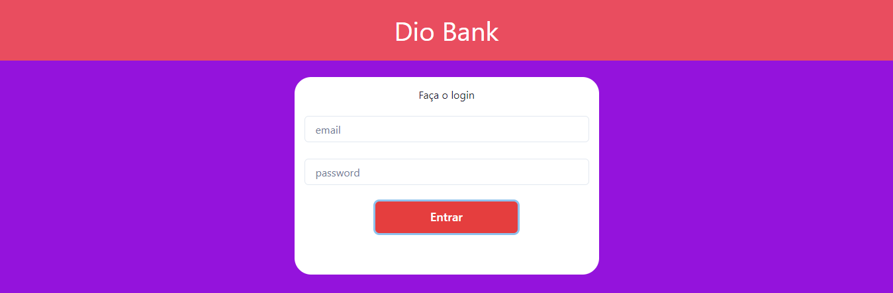
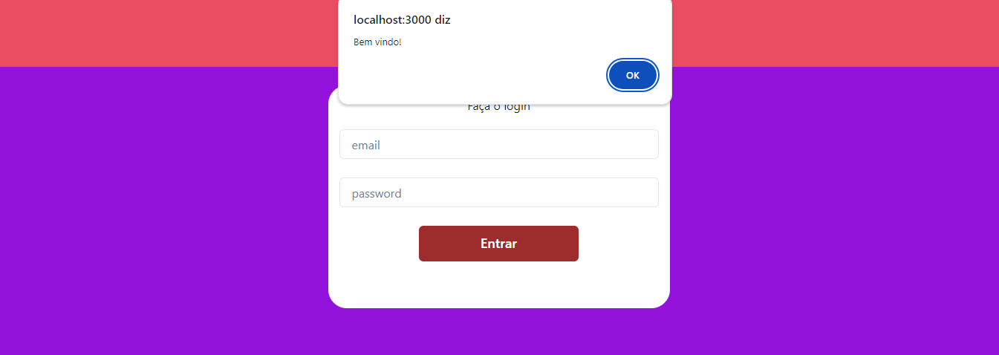

# Desafio 02 da formação TypeScript Full Stack Developer - DIO

## 📝Resolução do desafio 02

### 💻 Tecnologias

### 🔍 Observações

#### O desafio consiste em criar componentes de uma página inicial usando TypeScript no React e realizar teste unitário em uma funcionalidade de um dos componentes.

🧪Com esse desafio consegui pôr em prática conceitos básicos de React aprendidos em aula como a **criação de componentes**, **propriedades do componente**, **estilização usando a Lib Chakra UI** e **testes unitários com Jest**.

1️⃣Criei o componente Header e Button como proposto no desafio.

2️⃣Estilizei cada componente usando Chakra UI.

3️⃣Componente Card foi refatorado para receber o formulário e apenas ele é chamado na página inicial como pedido.

4️⃣Alert com mensagem de boas vindas foi inserido como funcionalidade no botão.

5️⃣Teste unitário da funcionalidade foi crido e executado.

